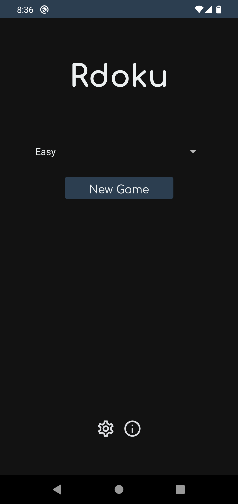
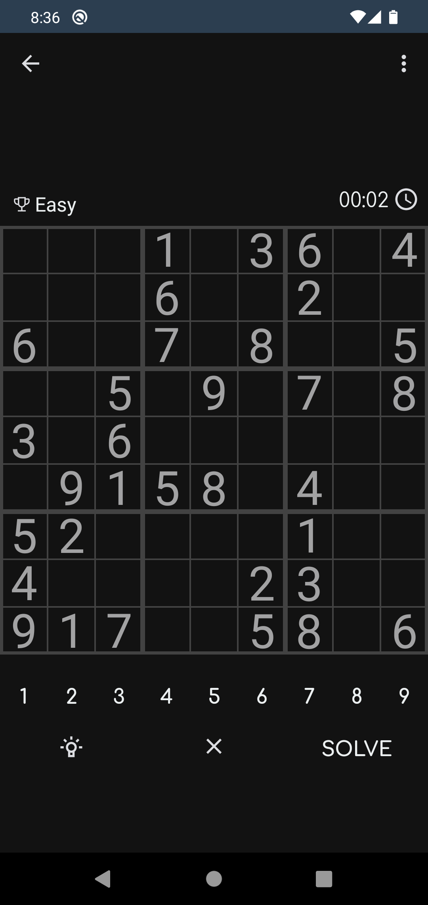
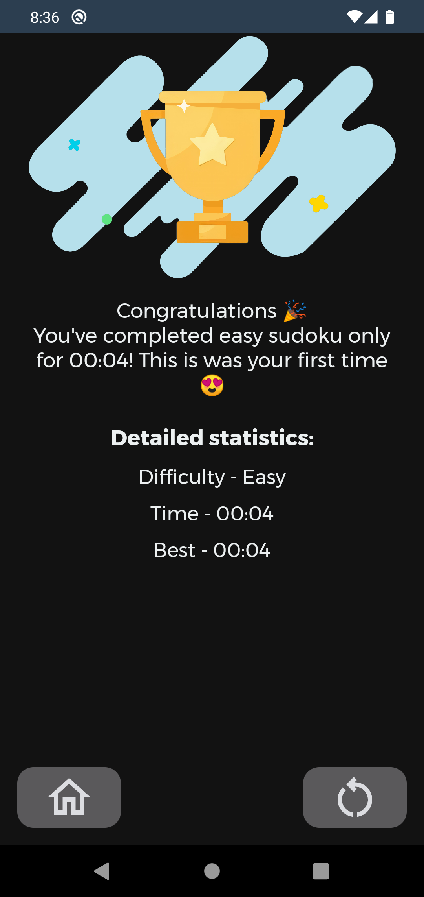
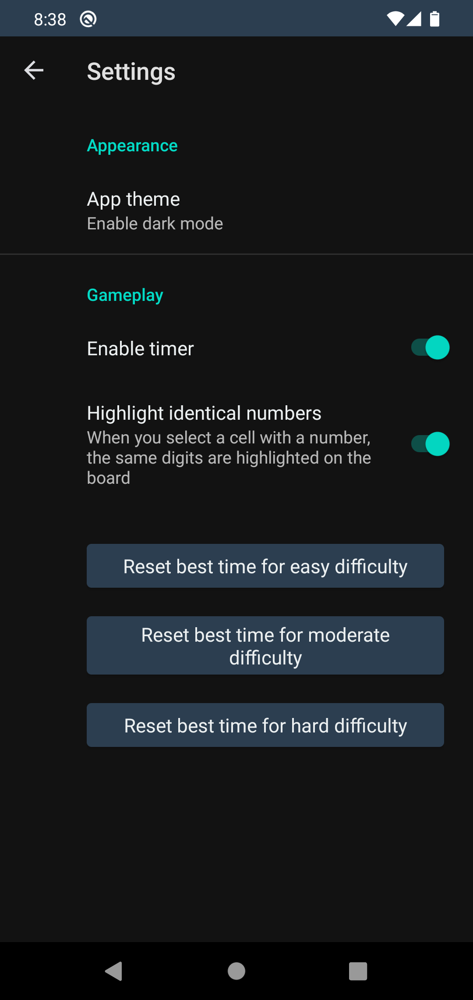

<h1>Rdoku - Light sudoku for android, made by noob in kotlin and android studio.</h2>

The game has English and Russian languages
This app has built-in valid sudoku board generating algorithm (valid board is the board with one unique solution). But the fewer or more filled cells you need to generate, the longer it takes to generate it and that's why the app also has 1000 pregenerated hard boards! There are 3 difficulties: easy, moderate and hard. The first two are generating in real time and the hard one is just taking the board from the list of hard boards.
When I finish the app, there will be screenshots.
P.S I hope your eyes not bleed in result of my english grammar...
  <b>WARNING!</b> There are some emojis in app 😨
    I don't have much free time but I will try to keep the app up to date and add new features ❤️

    Plans:
    <ul>
      <li>Optimize level creating</li>
      <li>6x6 mode</li>
      <li>Remake sudoku board view</li>
      <li>Landscape mode</li>
    </ul>

  

    
    
  

  

    
    
  

This app was initially created for my college exam

