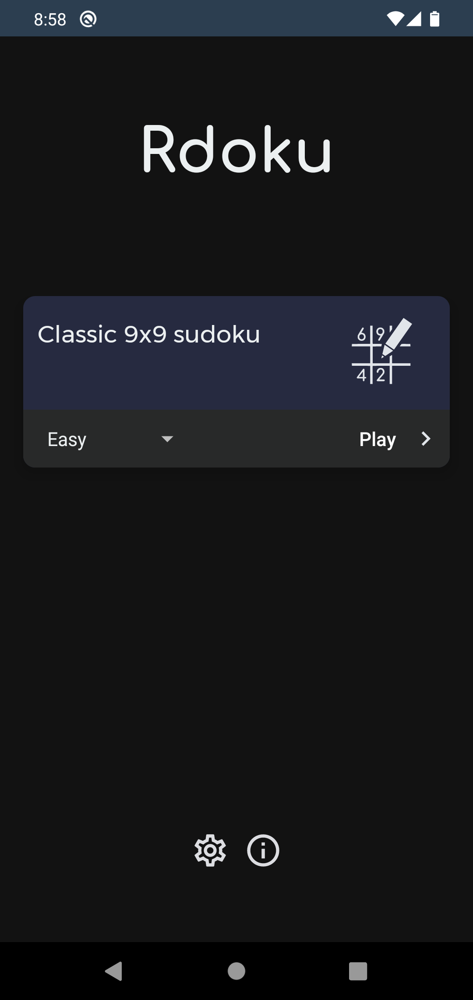
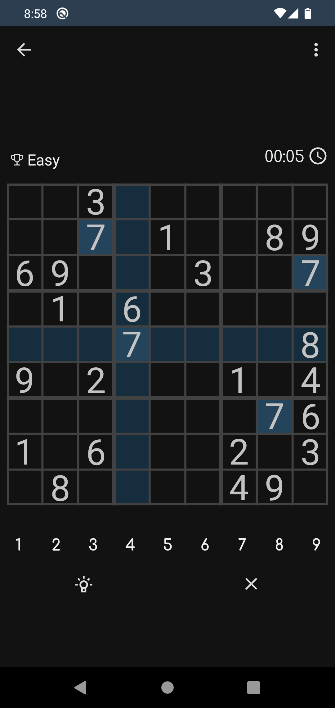

<h1>Rdoku - Light sudoku for android, made by noob in kotlin and android studio.</h2>

This is sudoku. Android sudoku. Written in Kotlin. English and russian languages.
  <b>WARNING!</b> There are some emojis in app 😨🥶🥶
    I don't have much free time but I will try to keep the app up to date and add new features （づ￣3￣）づ╭❤️～

  

    
    
    
  

This app was initially created for my college exam

