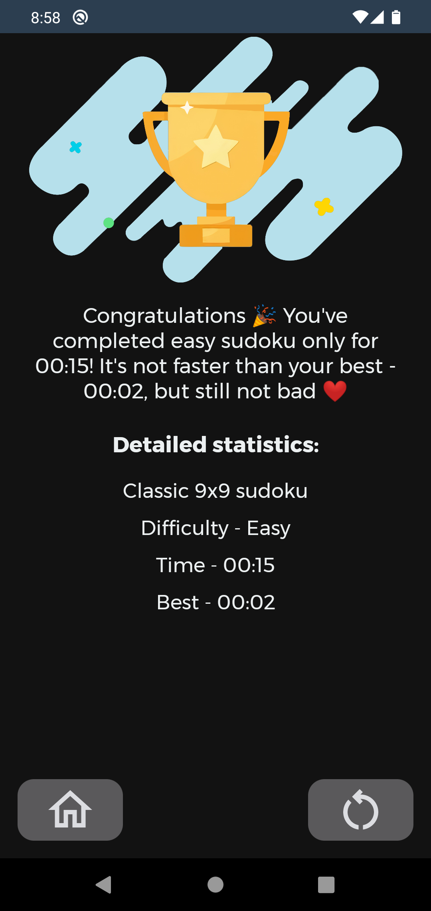

<h1>Rdoku - Light sudoku for android, made by noob in kotlin and android studio.</h2>
<b>Because of my inexperience in the past (not like I'm a professional now), the project needs a lot of optimization and refactoring, unfortunately I probably won't have time to do this. I do not advise you to use my code, there are many bad approaches to solving problems, but if you want to then feel free to use.</b>

This is sudoku. Android sudoku. Written in Kotlin. English and russian languages.
  <b>WARNING!</b> There are some emojis in app 😨🥶🥶
    I don't have much free time but I will try to keep the app up to date and add new features （づ￣3￣）づ╭❤️～

  

    
    
    
  

This app was initially created for my college exam

